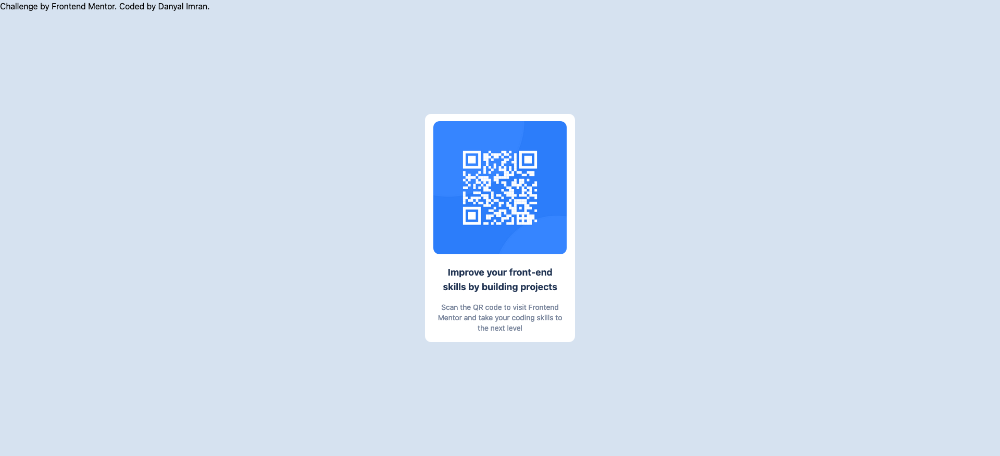

# Frontend Mentor - QR code component solution

This is a solution to the [QR code component challenge on Frontend Mentor](https://www.frontendmentor.io/challenges/qr-code-component-iux_sIO_H). Frontend Mentor challenges help you improve your coding skills by building realistic projects. 

## Table of contents

- [Overview](#overview)
  - [Screenshot](#screenshot)
  - [Links](#links)
- [My process](#my-process)
  - [Built with](#built-with)
  - [What I learned](#what-i-learned)
  - [Continued development](#continued-development)
  - [Useful resources](#useful-resources)
- [Author](#author)
- [Acknowledgments](#acknowledgments)


## Overview

### Screenshot




### Links

- Code: [Code](https://github.com/imRanDan/qr-code-component-main)
- Live Site URL: [The live code](https://imrandan.github.io/qr-code-component-main/)

## My process

### Built with

- HTML5 markup
- CSS custom properties
- TailwindCSS

### What I learned

Figuring out a new technology, struggling, and then eventually putting something together was a big win for me. I learned how to use flex, padding, margins, custom elements, and basic setup to get tailwind working for this project.

```html
<div class="h-screen flex flex-col items-center 
  justify-center w-1/3 absolute left-1/3 h-64">
```
}

### Continued development

As this is my first project with TailwindCSS, I found it a bit difficult to figure out what the shortforms meant, so I will need to keep the documentation handy and as I build more projects I will get used to what everything means.

I also found that while I was able to get the project to be responsive horizontally, if I were to work on this more or come back to it later for further optimizations, I would add vertical responsiveness too.


### Useful resources

- [TailwindCSS Docs](https://tailwindcss.com/docs/installation) - The documentation (more specifically the search bar in the documentation) has a huge help in getting me to figure out how to style everything. Figuring out what all the shortform commands meant to make sure the margins, padding, and flex-box 

- [Traversy Media Tailwind CrashCourse] (https://www.youtube.com/watch?v=dFgzHOX84xQ&list=WL&index=2&t=4m35s) - I used the startup/installation method used in Traversy Media's video to set-up my project. I learned to implement and automate some of the tailwind installations so I wouldn't have to run it in terminal every time (in my package.json file)

## Author

- Website - [Danyal Imran](https://danyalimran.com/)
- Frontend Mentor - [@imRanDan](https://www.frontendmentor.io/profile/imRanDan)

## Acknowledgments

Shoutout Brad Traversy for teaching me TailwindCSS and setting up the project with his TailwindCSS Crash course video on YouTube! Also, shoutout to the TailwindCSS Documentation (I would be lost without you, lol)
